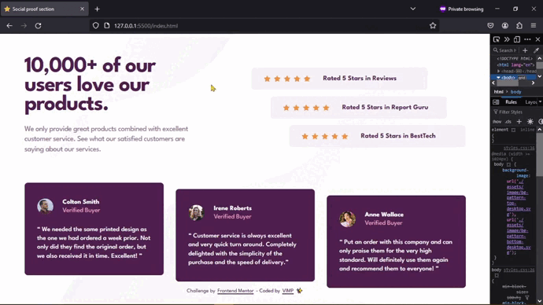
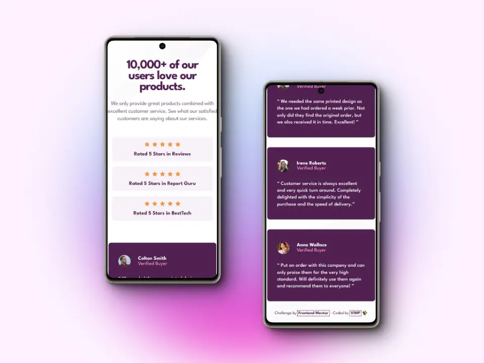
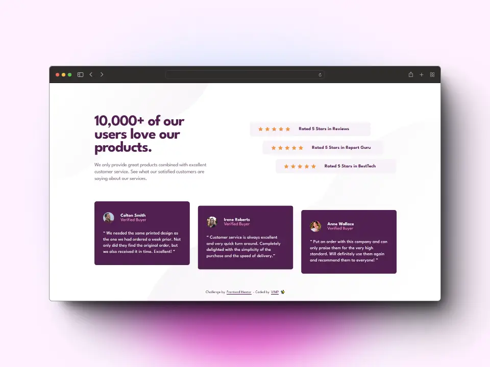

# Frontend Mentor - Social proof section solution

This is a solution to the [Social proof section challenge on Frontend Mentor](https://www.frontendmentor.io/challenges/social-proof-section-6e0qTv_bA).

Frontend Mentor challenges help you improve your coding skills by building realistic projects.

## Table of contents

- [The challenge](#the-challenge)
- [Screenshot](#screenshot)
- [Links](#links)
- [Built with](#built-with)
- [Useful resources](#useful-resources)
- [Author](#author)

## *The challenge*

Users should be able to:

🎯 View the optimal layout for the section depending on their device's screen size

## *Screenshot*

### 📱 Mobile

### 💻 Desktop

## *Links*

[Live site](https://mendez-v.github.io/social-proof-section/) 👀

<!-- [Solution in Frontend Mentor](https://your-solution-url.com) 👀 -->

[Challenge repository](https://github.com/mendez-v/frontend-mentor-challenges) 👀

## *Built with*

📌 Semantic HTML5 markup

📌 CSS custom properties

📌 Flexbox

📌 CSS Grid

📌 Mobile-first workflow

## *Useful resources*

🌈 Favicon - <a href="https://iconscout.com/icons/star" class="text-underline font-size-sm" target="_blank">Star</a> by <a href="https://iconscout.com/contributors/turan-kent" class="text-underline font-size-sm" target="_blank">Turan Kent</a>

## *Author*

- Frontend Mentor - [@mendez-v](https://www.frontendmentor.io/profile/mendez-v)

